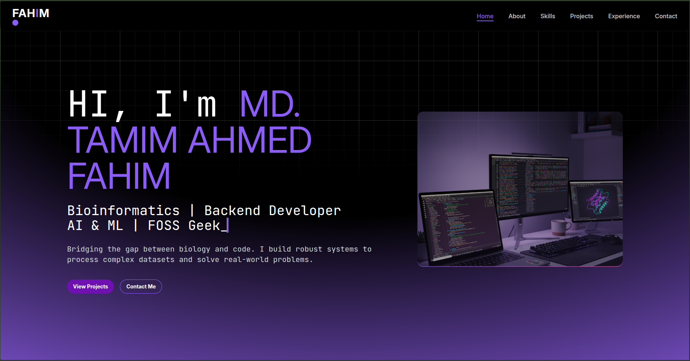
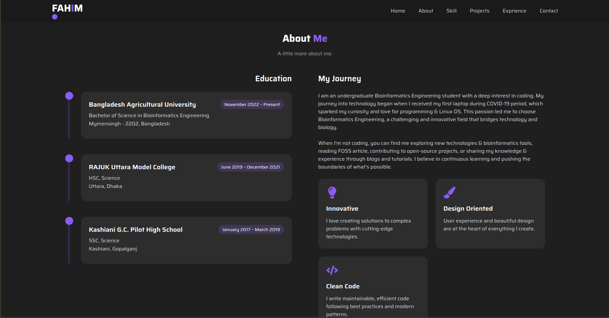
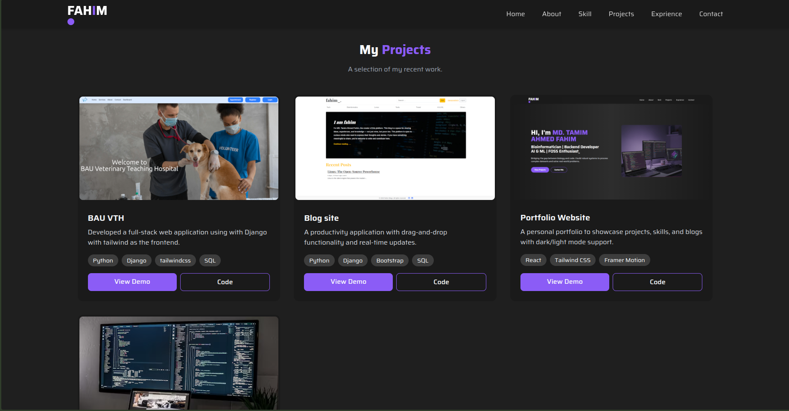
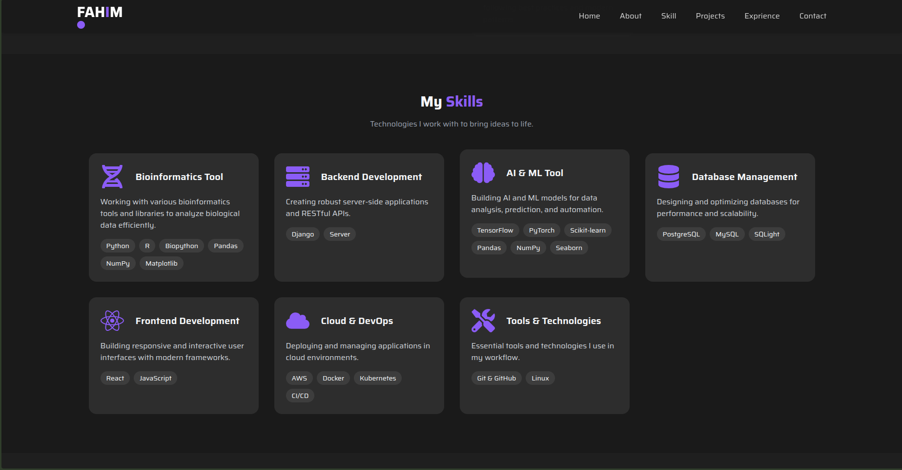
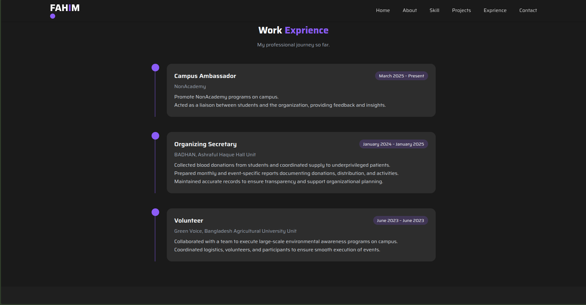
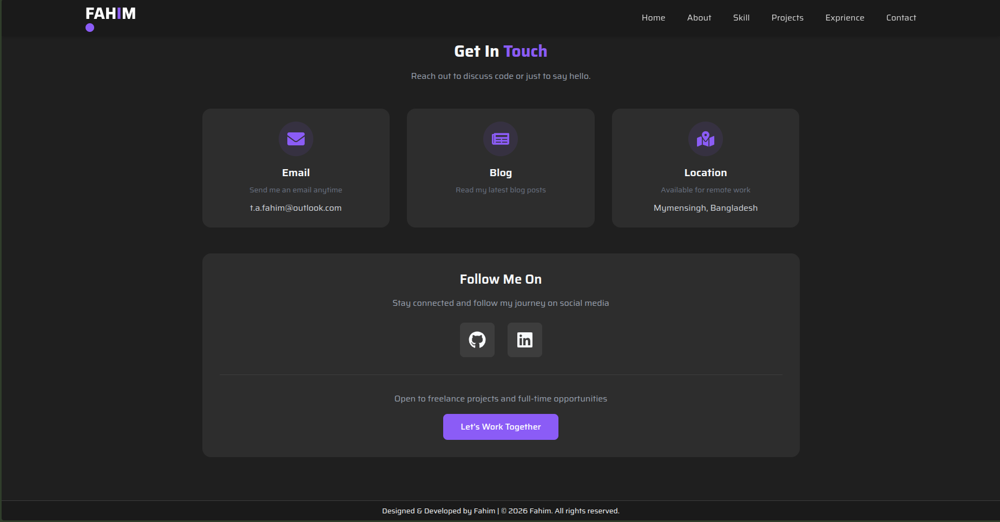
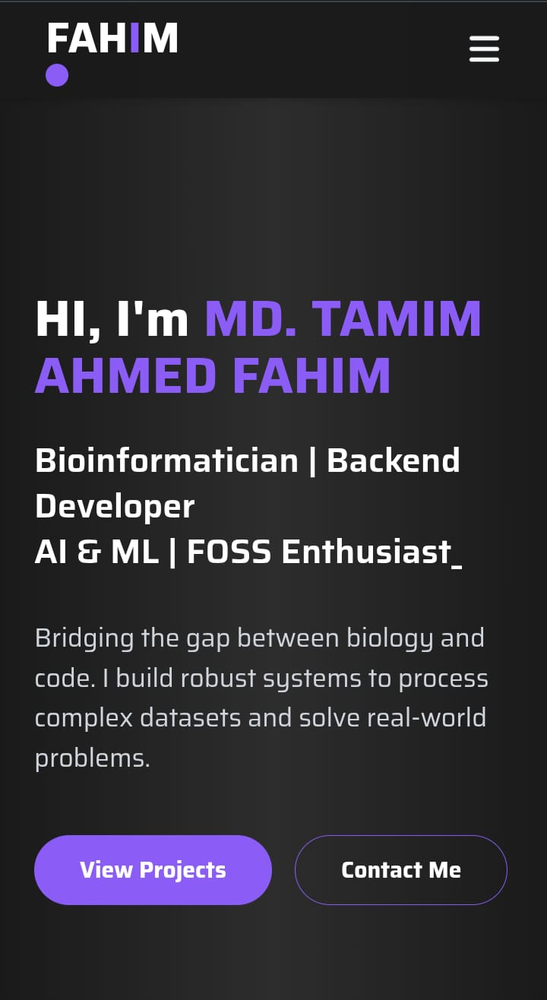

# My Portfolio

A modern, responsive portfolio website built with React to showcase my projects, skills, and professional experience.

## 🔗 Demo Link

[Live Portfolio](https://t-fahim.github.io) 

---

## 📑 Table of Contents

- [About My Portfolio ](#about-my-portfolio)
- [Screenshots of Visualization](#screenshots-of-visualization)
- [Technologies](#technologies)
- [Setup](#setup)
- [Approach](#approach)
- [Status](#status)
- [Credits](#credits)
- [Contact](#contact)

---

## About My Portfolio 

### Project Goals
The primary goal of this portfolio is to:
- Create a professional online presence to showcase my technical skills and projects
- Provide potential employers and clients with easy access to my work
- Demonstrate my proficiency in tech skills
- Establish a personal brand in the tech industry

### Why This Project?
I selected this portfolio project to:
- Consolidate all my projects and achievements in one accessible location
- Practice and demonstrate real-world development skills
- Create a platform that can evolve as I grow professionally
- Stand out in the competitive job market with a unique, personalized showcase

### Challenges Faced
Throughout the development process, I encountered and overcame several challenges:
- **Responsive Design**: Ensuring the portfolio looks great on all devices required careful planning of the layout and extensive testing
- **Content Organization**: Structuring project information in a way that's both comprehensive and digestible
- **Design Consistency**: Maintaining a cohesive visual identity across all sections while keeping it engaging

---

## Screenshots of Visualization

### Homepage - Hero Section



*Clean, modern landing page with animated introduction and always top navbar*

### About me



*Detailed overview of my background, technical expertise, soft skills, and professional aspirations*

### Projects Showcase



*Interactive project cards showcasing some of my recent work with live demos and source code links*

### Skills & Technologies



*Visual representation of technical skills with proficiency indicators*

### Work Experience



*Professional timeline showcasing my work experience, roles, and key achievements*

### Contact info



*Functional contact form with email integration and social media links*

### Mobile Responsive View



*Fully responsive design optimized for mobile and tablet devices*

### Key Features Demonstrated
- **Smooth Navigation**: Single-page application with smooth scrolling
- **Interactive Elements**: Hover effects, animations, and transitions
- **SEO Optimized**: Meta tags and semantic HTML for better search visibility

---

## Technologies

This portfolio was built using modern web development technologies:

**Core Technologies:**
- **React 18.x** - JavaScript library for building user interfaces
- **React Router** - Client-side routing for navigation
- **JavaScript (ES6+)** - Modern JavaScript features

**Styling:**
- **TailwindCSS** - Utility-first CSS framework for responsive design
- **CSS** - Custom styling for colors, text
- **Responsive Design** - Mobile-first approach

**Additional Libraries:**
- **React Icons** - Icon library for UI elements
- **Framer Motion** - Animation library
- **React icon** - Icon library


**Development Tools:**
- **Node.js & npm** - Package management
- **Git & GitHub** - Version control
- **VS Code** - Code editor
- **ESLint** - Code linting


**Deployment:**
- **GitHub Pages** - Hosting platform

---

## Setup

### Prerequisites
Before you begin, ensure you have the following installed:
```bash
Node.js (v14.0 or higher)
npm (v6.0 or higher)
Git
```
### Installation

1. **Clone the repository:**
```bash
git clone https://github.com/t-fahim/my-blog.git
cd my-blog
```

2. **Install dependencies:**
```bash
npm install
```

### Usage

**Run the development server:**
```bash
npm run dev
```
The application will open at `http://localhost:3000`

**Build for production:**
```bash
npm run build
```

**Deploy:**
```bash
npm run deploy
```
---

## Approach

### 1. Planning & Design
- Defined color scheme and typography
- Planned component structure and user flow
- Established content hierarchy and sections

### 2. Project Setup
- Initialized React application using Vite
- Set up project structure with organized folders (components, pages, assets, styles)
- Configured Git repository and version control workflow
- Established coding standards and conventions

### 3. Component Development
- Built reusable React components following best practices
- Implemented component composition for maintainability
- Created responsive layouts using TailwindCSS
- Developed interactive UI elements with React state management

### 4. Content Integration
- Integrated images and media assets optimized for web
- Use assets.js for data which need to change regularly

### 5. Styling & Responsiveness
- Applied CSS styling with a mobile-first approach
- Implemented responsive breakpoints for various screen sizes
- Added animations and transitions for enhanced user experience
- Ensured cross-browser compatibility

### 6. Testing & Optimization
- Tested functionality across different browsers and devices
- Optimized images and assets for faster load times
- Implemented code splitting for better performance

### 7. Deployment
- Built production-ready application bundle using `npm run build`
- Configured `package.json` with homepage URL and deployment scripts
- Deployed to GitHub Pages using `gh-pages` branch
- Configured GitHub Actions for automatic deployment on push to main branch
- Ensured proper routing configuration for React Router compatibility
- Verified SSL certificate automatically provided by GitHub Pages

---

## Status

**Current Status:** Complete ✅

**Version:** 1.0.0

**Last Updated:** February 8, 2026

### Development Progress
- [x] Project planning and design
- [x] React application setup
- [x] Component development
- [x] Responsive styling implementation
- [x] Content integration
- [x] Contact form functionality
- [x] Cross-browser testing
- [x] Deployment to production
- [ ] Blog section (planned for v2.0)
- [ ] Advanced animations (planned for v2.0)

### Upcoming Features (v2.0)
- Blog section integration
- Enhanced animations with Framer Motion

---

## Credits

### Developer
- **MD. TAMIM AHMED FHAIM** - Developer & Bioinformatician

### Tools & Assets
- [React Icons](https://react-icons.github.io/react-icons/) - Icon library
- [Google Fonts](https://fonts.google.com/) - Typography

### Special Thanks
- Open-source community for amazing tools and libraries

---

## 📄 License

This project is open source and available under the [MIT License](LICENSE).

---

## Contact

I'd love to hear from you! Feel free to reach out:

- **Email**: t.a.fahim@outlook.com
- **LinkedIn**: [linkedin.com/in/tamim-fahim](https://linkedin.com/in/tamim-fahim)
- **GitHub**: [@t-fahim](https://github.com/t-fahim)
- **Portfolio**: [t-fahim.github.io](https://t-fahim.github.io)

---

## 🌟 Show Your Support

If you found this portfolio inspiring or helpful, please consider:
- ⭐ Starring this repository
- 🍴 Forking it for your own use
- 📢 Sharing it with others

---

*Thank you for visiting my portfolio! This project represents my passion for web development and continuous learning.*